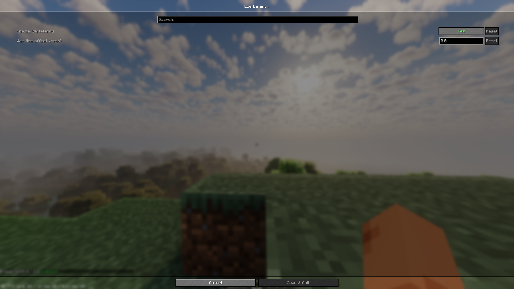
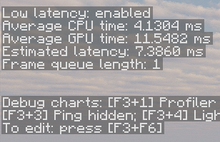

# Low Latency

[中文](README_CN.md)

This mod is designed to reduce input latency when the GPU is full load and the CPU is not, inspired by NVIDIA Reflex.

When the gpu is full load and the CPU is not, a frame queue backlog will build up, the input latency will increase.

This mod estimates input latency based on historical CPU and GPU frame times, and waits before input events to ensure the frame queue will not build up, which reduces input latency.

**The current version has a negative impact frame rate; on my device (13600KF, RTX 4060), it’s around a 10% drop. You can set the 'Wait time offset' to -1 in the config screen. This will resolve it, but it will increase input latency.**

You can enable/disable low latency feature in config screen.

### 规划

- [ ] Autocorrect wait time

#### Config Screen

#### F3 Debug Screen

